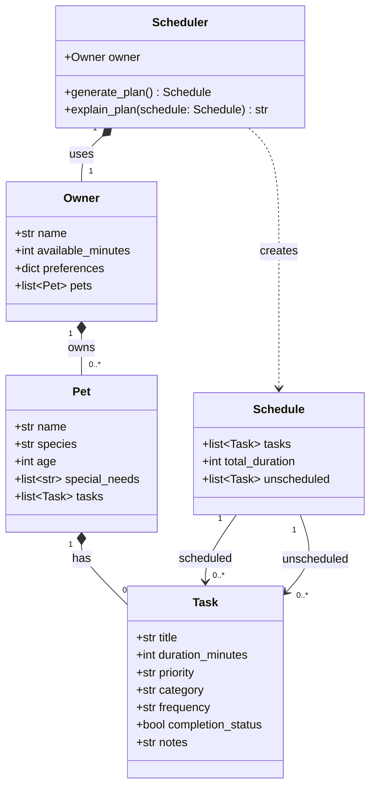

# PawPal+ Design Document

## UML Class Diagram



## Class Descriptions

### Owner
Represents the pet owner. Stores their name, daily time budget (`available_minutes`), optional preferences, and a list of pets they care for.

### Pet
Represents a pet. Stores the pet's name, species, age, special needs, and the list of care tasks associated with that pet.

### Task
A single care activity. Has a title, duration, priority (`"low"`, `"medium"`, or `"high"`), category, frequency (e.g., `"daily"`, `"weekly"`, `"once"`), completion status, and optional notes.

### Schedule
The output of planning. Contains tasks that fit within the owner's time budget (`tasks`), tasks that could not be scheduled (`unscheduled`), and the total duration of scheduled tasks.

### Scheduler
The core engine. Takes an `Owner` and retrieves tasks across all their pets. `generate_plan()` sorts tasks by priority, fits them within `available_minutes`, and returns a `Schedule`. `explain_plan()` narrates why each task was included or excluded.

Priority strings are converted to integers for sorting using a module-level mapping:

```python
PRIORITY_ORDER = {"low": 1, "medium": 2, "high": 3}
```

## Core User Actions

The app exposes these actions a user must be able to perform:

| # | Action | Where | What it does |
|---|---|---|---|
| 1 | **Set up owner & pet** | Sidebar | Inputs for owner name, available minutes, pet name, species, age, special needs; stored in session state as `Owner` and `Pet` objects |
| 2 | **Add / edit / delete a task** | Main area — Task Manager | Form inputs (title, duration, priority, category, frequency, notes); tasks stored on the pet in session state |
| 3 | **Generate Plan** | Main area — Generate Plan button | Instantiates `Scheduler` with owner from session state, calls `generate_plan()`, displays scheduled and unscheduled tasks |
| 4 | **View explanation** | Main area — Explanation section | Calls `explain_plan(schedule)` and renders the explanation below the plan |

---

## Relationship Summary

| Relationship | Type | Description |
|---|---|---|
| Owner -> Pet | Composition | An owner manages one or more pets |
| Pet -> Task | Composition | A pet owns its care tasks |
| Scheduler -> Owner | Composition | The scheduler is configured for a specific owner |
| Scheduler -> Schedule | Dependency | `generate_plan()` creates and returns a new Schedule instance |
| Schedule -> Task | Association | A schedule references tasks from the pets' task lists |
